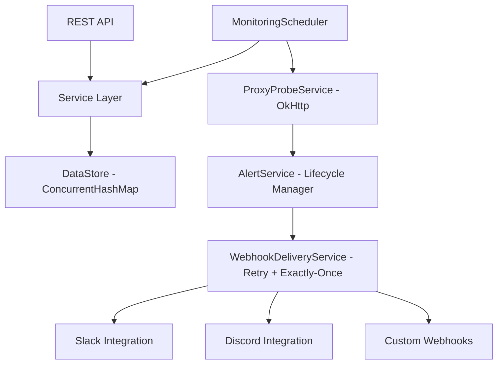

# ProxyMaze

A real-world backend monitoring system for proxy servers built with **Spring Boot 3 + Java 21**.

ProxyMaze is designed to monitor a fleet of proxy servers, detect downtime, and notify stakeholders via Webhooks, Slack, and Discord. It features a dynamic configuration system, an alert lifecycle manager, and a reliable delivery engine with exponential backoff.

## Architecture



## Features

- **Live Monitoring**: Background probes using OkHttp to verify proxy health (2xx = UP).
- **Dynamic Configuration**: Change monitoring intervals and thresholds on the fly without restarts.
- **Alert Lifecycle**: Intelligent state management (ACTIVE → RESOLVED) ensuring no alert fatigue.
- **Reliable Webhooks**: Delivery with exponential backoff and idempotency keys.
- **Rich Integrations**: Native support for Slack Block Kit and Discord Embeds.
- **Thread Safe**: Built for high concurrency using `java.util.concurrent` primitives.

## Endpoints

| Method | Path | Description |
|--------|------|-------------|
| **Config** | | |
| GET | `/config` | Get current runtime configuration |
| POST | `/config` | Update configuration (restarts scheduler dynamically) |
| **Proxies** | | |
| POST | `/proxies` | Add proxy URLs to monitor |
| GET | `/proxies` | List all proxies with live status |
| GET | `/proxies/{id}` | Get single proxy details |
| GET | `/proxies/{id}/history` | View historical check results |
| DELETE | `/proxies` | Clear all monitored proxies |
| **Alerts** | | |
| GET | `/alerts` | List all historical and active alerts |
| GET | `/alerts/active` | Get current active alert state |
| **Integrations** | | |
| POST | `/webhooks` | Register a raw JSON webhook receiver |
| POST | `/integrations` | Register Slack or Discord integration |
| GET | `/integrations` | List all registered integrations |
| DELETE | `/integrations/{id}` | Remove an integration |
| **System** | | |
| GET | `/health` | Application health check |
| GET | `/metrics` | Real-time system metrics |

## Local Development

### Prerequisites
- Java 21
- Maven 3.9+

### Run
```bash
mvn clean package -DskipTests
java -jar target/proxymaze-1.0.0.jar
```

## Deployment Plan

ProxyMaze is designed for **direct deployment from a local environment to Google Cloud Run**. This avoids the complexity of GitHub Actions or intermediate CI/CD pipelines for smaller, focused deployments.

### 1. Build the Artifact
First, generate the executable JAR file locally:
```bash
mvn clean package -DskipTests
```

### 2. Deploy to Cloud Run
The deployment uses the local source code and the pre-built JAR. Google Cloud Build will package the container based on the provided `Dockerfile`.

```bash
gcloud run deploy proxymaze \
    --source . \
    --region us-central1 \
    --allow-unauthenticated \
    --port 8080
```

> [!IMPORTANT]
> **Why Local Deployment?**
> - **Speed**: Instant deployment without waiting for GitHub runners.
> - **Simplicity**: No need to manage GitHub Secrets or complex YAML workflows.
> - **Direct Control**: Immediate feedback in the local terminal during the build/push phase.

## Key Design Decisions

- **Background monitoring**: `ScheduledExecutorService` runs continuously, decoupled from API request cycles.
- **Alert lifecycle**: Strict "one active alert" policy per breach period; resolution triggers status updates across all integrations.
- **Retry Logic**: Exponential backoff (1s to 30s cap) for transient delivery failures.
- **Performance**: Zero-database architecture using optimized in-memory storage for sub-millisecond response times.
- **Probes**: Configurable timeouts and user-agent headers to simulate real traffic.
